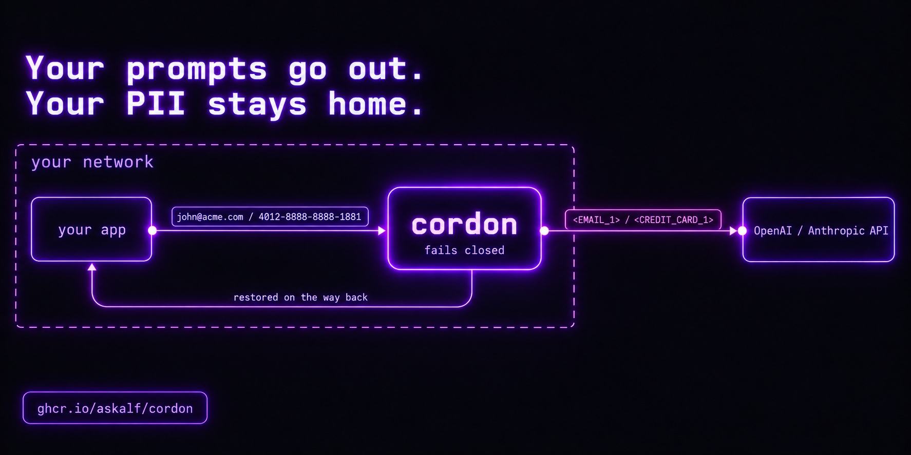

<p align="center"></p>

# cordon

[](https://github.com/askalf/cordon/actions/workflows/ci.yml)
[](https://github.com/askalf/cordon/actions/workflows/codeql.yml)
[](https://scorecard.dev/viewer/?uri=github.com/askalf/cordon)
[](LICENSE)

**A PII-redacting proxy for the OpenAI and Anthropic APIs.** Point your client at cordon instead of the provider. Emails, phone numbers, card numbers, SSNs, API keys and the rest are replaced with placeholders before the request leaves your network, and put back in the reply so your app never notices. One container, no database, no ML model, no client code changes beyond the base URL.

```
your app ──▶ cordon ──▶ api.openai.com / api.anthropic.com
              │
              ├─ model receives:    email <EMAIL_5285D1_1> re card <CREDIT_CARD_5285D1_1>
              └─ your app receives: email john@acme.com re card 4012-8888-8888-1881
```

## Quickstart

```bash
docker run -d --name cordon --init -p 127.0.0.1:8080:8080 \
  -v cordon-data:/app/data -e ADMIN_TOKEN=change-me \
  ghcr.io/askalf/cordon:v0.3.0
```

Then change one thing in your client: the base URL. Anthropic clients use `http://localhost:8080`, OpenAI clients use `http://localhost:8080/v1`. Your provider key goes through untouched; cordon never holds it. Every response says what it did: `X-Redacted: 2`, `X-Redacted-Types: EMAIL:1,CREDIT_CARD:1`.

A full captured round trip (both clients, the headers, what the provider was sent and the audit line) is in [docs/reference.md](docs/reference.md#a-full-round-trip).

## What it catches

Deterministic detection: regex plus checksum validators, no ML dependencies, fully auditable. Every entity with a check digit is validated before its span is accepted (Luhn for cards, ISO 7064 mod-97 for IBANs, ABA for routing numbers, SSN area/group rules), and overlapping matches resolve by precedence so a 16-digit card is not also clipped as a phone number.

| set | entities |
|---|---|
| `pii` | EMAIL, PHONE, SSN, IPV4, IPV6, MAC, STREET_ADDRESS |
| `phi` | MRN, DATE *(and SSN)* |
| `pci` | CREDIT_CARD, IBAN, US_ROUTING |
| `secrets` | OpenAI / Anthropic / AWS / GitHub / Google / Slack keys, JWTs, Bearer tokens, PEM private keys |

All four sets are on by default. Narrow them per tenant; a request can add sets with `X-Redact-Sets` but not drop them (see below).

## How it behaves

- **Fails closed.** If detection throws, the request is **blocked**, never forwarded with PII intact (`FAIL_MODE=closed`, the default). The test suite asserts the upstream is never called on that path.
- **Three modes**, per tenant or per request (`X-Redact-Mode`, tighten only by default):
  - **`reversible`** *(default)*: placeholders go up, real values come back in the reply, including mid-stream. Tokens carry a per-request random nonce (`<EMAIL_5285D1_1>`, not `<EMAIL_1>`) so a caller's own placeholder-shaped text can never be rewritten to a real value.
  - **`strip`**: irreversible placeholders (`[EMAIL]`); nothing is restored. For when the answer never needs the real value.
  - **`off`**: passthrough, still audited as a bypass.
- **Policy is a floor.** A caller's `X-Redact-Mode` / `X-Redact-Sets` can only make redaction stricter than the tenant or global policy; `X-Redact-Mode: off` or a narrower set list is refused with 403 and never forwarded. Allow loosening per tenant (`allowHeaderOverride`) or globally (`ALLOW_HEADER_OVERRIDE=true`).
- **The tenant comes from the API key.** `X-Tenant` is ignored unless you set `TRUST_TENANT_HEADER=true`, and even then it can only select a tenant whose policy is at least as strict as the one the caller's key already gets (403 otherwise). It does choose the tenant name recorded in the audit log and metrics.
- **Admin API is off until you set `ADMIN_TOKEN`.** Without it `/admin/*` returns 403 rather than running open.
- **Tamper-evident audit.** Every request appends a hash-chained record of counts and types, never values; `npm run audit` verifies the chain.
- **Per-tenant policy**: consistent pseudonyms, data residency (regional upstreams), durable policy store.
- **Signed releases**: multi-arch GHCR images with keyless Sigstore provenance and an SBOM.

```
X-Redact-Mode: strip   →   "text":"email [EMAIL] re card [CREDIT_CARD]"
```

## What it does not do

- **Names, free-text addresses, medical conditions.** There is no NER. A person's name in prose passes through. The detector is an interface (`src/detect`), so a Presidio-style sidecar can be added; it is not included.
- **Embeddings, `count_tokens`, images.** Only the three generation endpoints (`/v1/chat/completions`, `/v1/responses`, `/v1/messages`) are redacted; other `/v1/*` paths, including `/v1/responses/{id}`, pass through verbatim. A spelling of a generation endpoint the provider can still resolve (a trailing slash, `.`/`..` segments, a different case, percent-escapes) is redacted like the endpoint itself. Image and file parts are left untouched.
- **Token counts.** Streaming usage figures are the provider's, computed on the de-identified text.

If you need one of those, say so in an issue. The scope above is deliberate, not accidental.

## Reference

- [docs/reference.md](docs/reference.md): the full round trip, audit log format and verification, per-tenant policy, ops endpoints (`/healthz`, `/metrics`, `/dashboard`, `/admin/*`), configuration.
- [docs/deploy.md](docs/deploy.md): compose, `deploy.sh`, verifying a release's attestation, using cordon with [dario](https://github.com/askalf/dario).
- [docs/development.md](docs/development.md): running from source and what the test suite proves.
- [CHANGELOG.md](CHANGELOG.md) · [SECURITY.md](SECURITY.md) · [CONTRIBUTING.md](CONTRIBUTING.md)

## Part of Own Your Stack

cordon guards the prompt. The rest of the Own Your Stack tools guard the agent around it: [redstamp](https://github.com/askalf/redstamp) contains the tool call, [truecopy](https://github.com/askalf/truecopy) vets the tool before it is installed, [browser-bridge](https://github.com/askalf/browser-bridge) governs the browser, and [plumbline](https://github.com/askalf/plumbline) watches the whole action sequence against the declared job. cordon and plumbline sit beside that path rather than in it.
